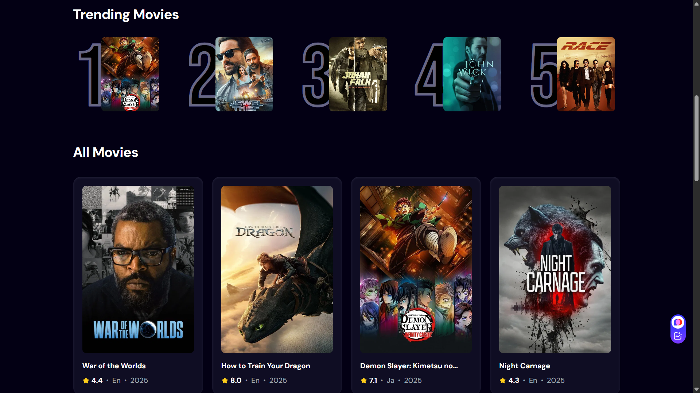
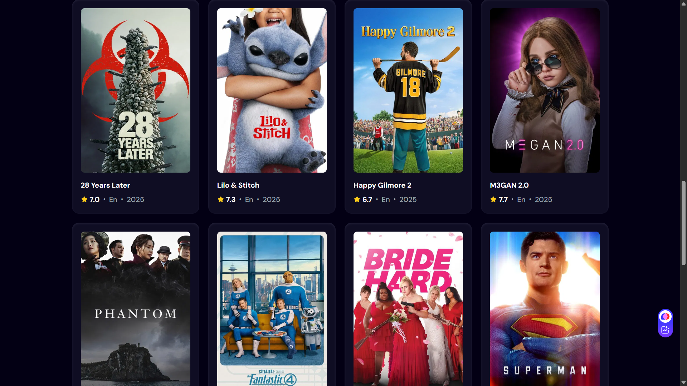

# 🎥 Movie Discovery App

A sleek and dynamic movie discovery platform where users can search for any movie and explore trending picks based on user interest. Built using **React**, **TMDB API**, and **Appwrite**.

---

## 🚀 Features

* 🔎 **Debounced Search**: Prevents excessive API calls as you type.
* 🌟 **Trending Movies**: Shows most searched movies (tracked via Appwrite).
* 🎨 **Responsive UI**: Clean design with light/dark support.
* ⚡ **Loading Skeletons**: Smooth UX during data fetch.
* 📊 **Search Analytics**: Tracks how often each movie is searched.

---

## 🖼️ Screenshots





---

## 🌐 Live Preview

[View Live Demo](https://your-live-preview-link.com)

---

## 🛠️ Tech Stack

### 🔝 Frontend

* React
* Tailwind CSS
* TMDB API
* React-use (for debounce)

### ☁️ Backend (BaaS)

* Appwrite

  * Trending movie tracking
  * Storing search counts and posters

---

## ⚙️ Setup & Installation

### 1. 📦 Clone the repo

```bash
git clone https://github.com/your-username/movie-discovery-app.git
cd movie-discovery-app
```

### 2. 📁 Create `.env` file

Create a `.env` file in the root directory and add:

```env
VITE_TMDB_API_KEY=your_tmdb_api_key
VITE_APPWRITE_PROJECT_ID=your_project_id
VITE_APPWRITE_DATABASE_ID=your_database_id
VITE_APPWRITE_COLLECTION_ID=your_collection_id
VITE_APPWRITE_ENDPOINT=https://fra.cloud.appwrite.io/v1
```

### 3. 📅 Install dependencies

```bash
npm install
```

### 4. 🧪 Start development server

```bash
npm run dev
```

---

## 🧠 Architecture Overview

* Debounced Search Input → `fetchMovies()` → TMDB API
* Trending Movies Section → `getTrendingMovies()` from Appwrite
* Update search count → Appwrite `createDocument()` or `updateDocument()`
* App state managed with `useState`, API calls wrapped in `useEffect`

---

## 🛥️ Known Issues

* Must manually create `count` (integer) attribute in Appwrite collection.
* TMDB API key must be valid and active.
* Add `http://localhost:5173` in Appwrite project CORS settings.

---

## 🛠️ Tips

* Use Appwrite Console to manage trending data.
* Restart dev server after any `.env` changes.

---

## 📄 License

This project is licensed under the [MIT License](LICENSE).

---

## 💬 Contact

Made with 💻 by [Likhit Rajendra Dhale]()

Feel free to contribute or raise issues!
